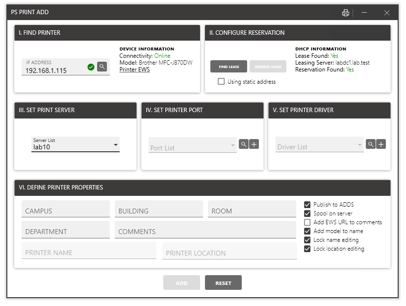

# psprintadd
A simple PowerShell/WPF tool to simplify adding printers to print servers. Fully multithreaded with protection for existing print ports and share names.

Using the IP address of a network connected printer, runs through the steps of adding to a print server. 

Requires RSAT. Add print server DNS names to printsrvList.json. 

